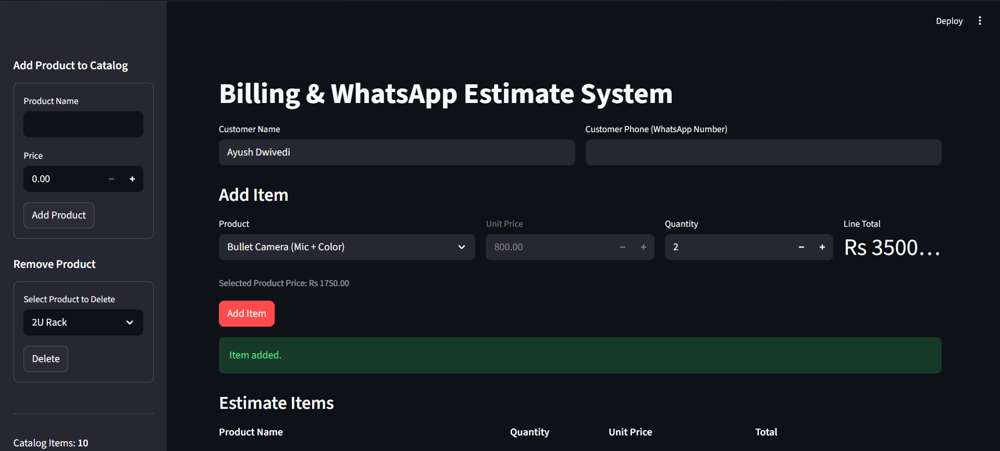
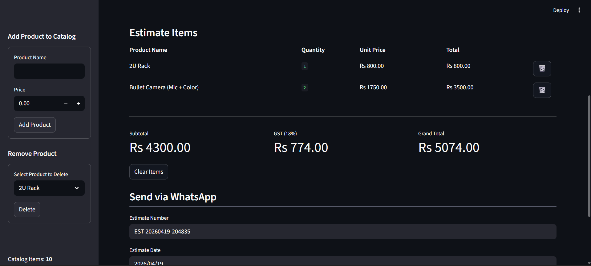
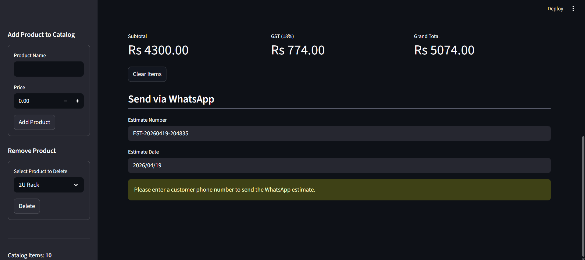

# Billing & WhatsApp Estimate System

A Python-based billing and estimate generation application designed for CCTV and weighing scale shops.
It allows users to manage products, create estimates, calculate GST, and send estimates directly via WhatsApp.

---

## Features

* Add and remove products from catalog
* Create multi-item estimates
* Automatic subtotal, GST (18%), and grand total calculation
* Add customer details during billing
* Generate and send estimates via WhatsApp

---

## Screenshots

### Main Interface



### Estimate and Calculation



### WhatsApp Section



---

## Tech Stack

* Python
* Streamlit
* Pandas

---

## How It Works

* Products are stored in a CSV file
* Users can dynamically add or remove products
* Selected items are added to a cart
* GST is applied automatically
* A formatted estimate is generated
* A WhatsApp link is created with pre-filled estimate details

---

## Run Locally

```bash
streamlit run app.py
```

---

## Project Structure

```
estimate-billing-app/
│
├── app.py
├── products.csv
├── requirements.txt
├── images/
│   ├── main.png
│   ├── estimate.png
│   ├── whatsapp.png
```

---

## Author

Ayush Dwivedi
